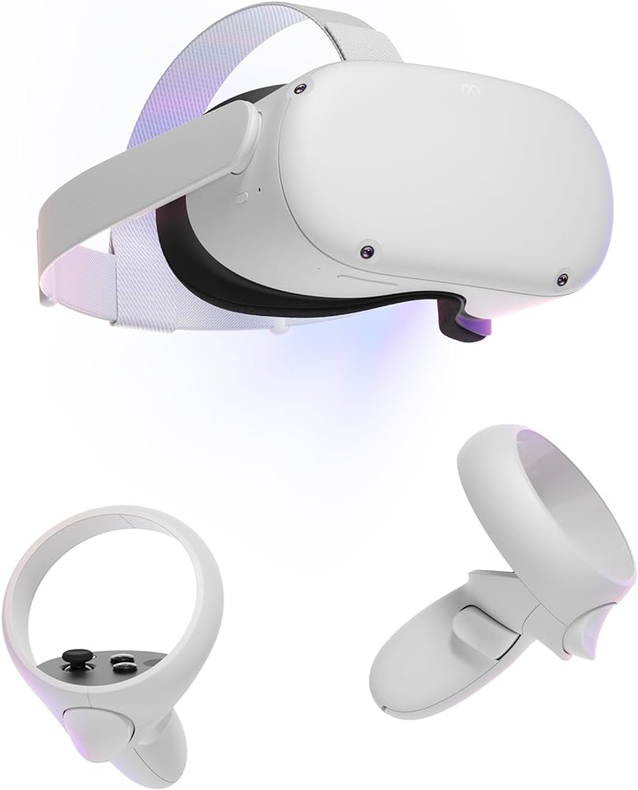

# Using Roblox and Virtual Reality to Teach Basic Game Development
## Description
- Difficulty Level: Beginner  
- Target Audience: Middle School and Up  
- Duration of workshop: Approximately 1 Hour  
- Needed Materials: VR Headset, Computer with Internet Connection, Roblox Studio.  
- Using Virtual Reality and Roblox Studio, the aim of this project is to garner an increased interest in the video game development field and STEM by attenuating the stigma of difficulty surrounding both programming and video game development as a whole.  
- Roblox Studio is a game development engine which allows you to build and program your own game. Throughout our workshop, students learn simple coding and 3D object manipulation.

[Video Demo](https://github.com/TechAmbassadors-GGC/VirtualWarriors/blob/main/media/TAP%20VR%20Video.mp4)

## Team
### Members  
- Red Godana  
- Ronoquade Lawrence  
- Sean Nolan  

### Advisors  
- Dr. Anca Doloc Mihu  
- Dr. Cindy Robertson  

### Team Photo  
  
(Left: Sean Nolan, Middle: Ronoquade Lawrence, Right: Red Godana)

## Publications
1. Red Godana, Ronoquade Lawrence, Sean Nolan, Anca Doloc-Mihu, Cindy Robertson. "Using Roblox and VR to Inspire Game Development Skills and STEM Interest", Consortium for Computing. Sciences in Colleges: Southeastern Region (CCSC:SE), November 4-5, 2023, Conway, SC
2. Red Godana, Ronoquade Lawrence, Sean Nolan, Anca Doloc-Mihu, Cindy Robertson. "Using Roblox and VR to Inspire Game Development Skills and STEM Interest", CREATE Symposium, Nov 30, 2023, Georgia Gwinnett College.

## Outreach Activities
1. Super Saturday Series (S3), October 28, 2023, Georgia Gwinnett College – workshop demo for middle and high school students to promote IT and STEM career
2. Tap Expo, Oct 10, 2023, Georgia Gwinnett College – workshop demo to promote IT field and the TAP program to college students
3. Classroom Workshops on Oct 24, Nov 14, and Nov 16, 2023: workshop demo to 1001 level IT students at GGC, to spark interests in IT, ITEC major opportunities, and the Game Development field
4. Consortium for Computing Sciences in Colleges (CCSC), Nov 3rd-4th, 2023, CCU: Poster presentation of project research results.

## Similar Projects

## Technology

This project uses the Meta Quest 2 Vir#al Reality headset for demos and a computer with Roblox Studio installed on it for the workshops.   
<b>Roblox Studio</b>   
- Roblox Studio is a free program that is used to create games and virtual worlds on the Roblox platform.  
- Download for free at https://create.roblox.com/

  

<b>Meta Quest 2</b>   
- The Meta Quest 2 is a virtual reality headset used to run various games including Roblox.  
- Purchase at https://www.meta.com/quest/products/quest-2/

  

## Project Setup/Installation
### Installing Roblox Studio
For instructions on how to install Roblox Studio please use the pdf file linked below.  

### Creating a Roblox Account
For instructions on how to create a Roblox account please use the pdf file linked below.  

### Downloading our Workshop File
For instructions on how to download our workshop file please use the pdf file linked below.  

## Usage
1. Find "TAP Roblox VR File.rbxl" or "TAP Roblox Workshop File.rbxl" located in the Code folder
2. Open the either roblox files in Roblox Studio by right clicking and select open with Roblox Studio
3. Click play to start the workshop
4. Follow along with the signs in the Roblox Studio file
